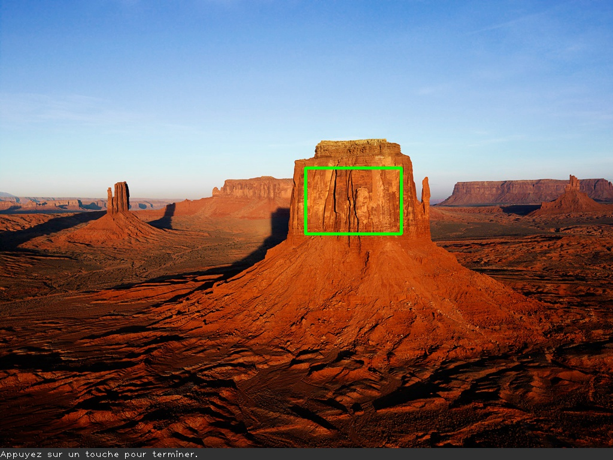

# VisIndus - labo01 - Installation OpenCV

## Buts

Les principaux buts sont :

- mettre en place un environnement virtuel Python 3.12,
- installer les diverses librairies.

## Labo01 - traitement simple d'une image

- chargez l'image `photo.jpg`,
- affichez cette matrice dans une fenêtre nommée `original`,
- écrivez le texte `Appuyez sur une touche pour terminer.` en bas à gauche de l'image, en couleur blanche sur fond gris,
- ajoutez un rectangle aux bords verts et épais, comme présenté dans l'image ci-dessous,
- sauvegardez l'image modifiée dans un fichier nommé `output.jpg`,
- affichez cette nouvelle dans une fenêtre nommée `modified`,
- affichez à la console la dimension en pixels de cette image,
- faites en sorte qu'il faille appuyer sur la barre d'espace pour terminer le programme et libérer les ressources utilisées.

