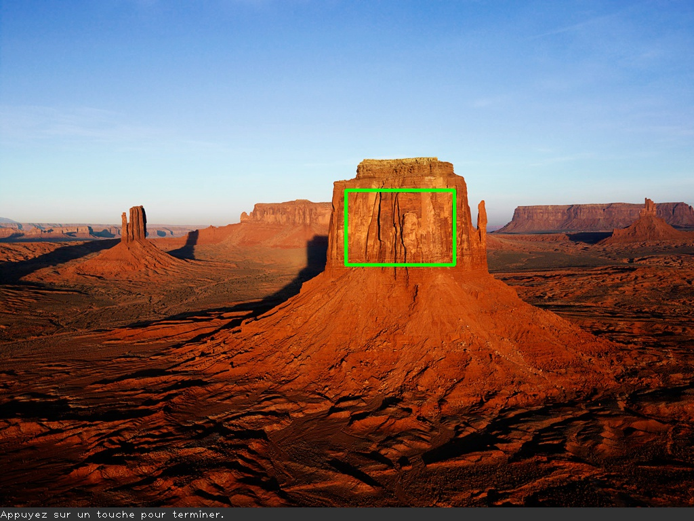

# VisIndus - 2020/2021 - labo01 - Installation OpenCV

## Buts

Les principaux buts sont :

- télécharger et installer OpenCV,
- exécuter une démo sur Visual Studio,
- créer un projet complet C++ - OpenCV.

Voir le lien-ci dessous pour le tutoriel en plus détaillé: https://medium.com/@sh.tsang/tutorial-opencv-v4-2-0-installation-in-windows-10-eca7c2c8c300.

## Prérequis

- Visual Studio

## Installation des outils

OpenCV 4.4.0: https://opencv.org/releases/

- cliquer sur Windows ou iOS, le téléchargement devrait se lancer automatiquement,
- double cliquer sur le fichier téléchargé et choisir un répertoire (`C:\\`) par exemple,
- extraire les fichiers.

## Setup des variables d'environnement

- taper dans la recherche Windows "variables d'environnement",
- dans les variables d'utilisateur, sélectionner `Path`, puis modifier,
- cliquer sur new pour ajouter un nouveau chemin: `C:\opencv\build\x64\vc15\bin` (le chemin dépend de votre emplacement).

## Lancer un programme de démo

Suivre les instructions du tutoriel de la section Buts.

Lorsque vous modifiez des paramètres dans "Project Properties", n'oubliez pas d'appuyer sur **appliquer** avant de changer d'onglet. Sinon vos modifications ne seront pas mémorisées.

ATTENTION : dans l'exemple fourni du tutoriel, la version d'openCV n'est pas la dernière. Il faudra donc mettre au point 2.2 :

- *opencv_world440d.lib* au lieu de *opencv_world420d.lib*,
- *opencv_world440.lib* au lieu de *opencv_world420.lib*.

## Labo01 - traitement simple d'une image

Créez un projet C++ compatible avec OpenCV et nommez-le `labo01`. Copiez le fichier `photo.jpg` dans le répertoire du projet et développez un logiciel permettant d'effectuer les opérations suivantes :

- chargez l'image `photo.jpg` dans une variable de type `Mat`,
- affichez cette matrice dans une fenêtre nommée `original`,
- écrivez le texte `Appuyez sur une touche pour terminer.` en bas à gauche de l'image, en couleur blanche sur fond gris,
- ajoutez un rectangle aux bords verts et épais, comme présenté dans l'image ci-dessous,
- sauvegardez l'image modifiée dans un fichier nommé `output.jpg`,
- affichez cette nouvelle dans une fenêtre nommée `modified`,
- affichez à la console la dimension en pixels de cette image,
- faites en sorte qu'il faille appuyer sur la barre d'espace pour terminer le programme et libérer les ressources utilisées.

